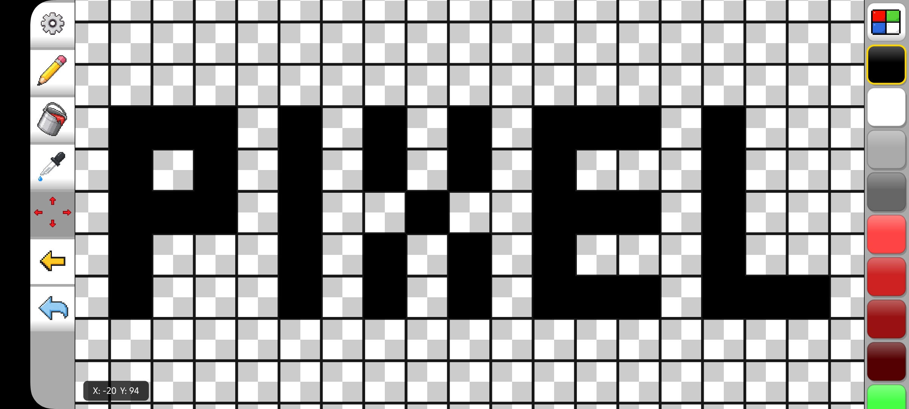

# PixelOne

PixelOne is a pixel art editor for Android focused on creating sprites, textures and small pixel projects in a simple way.

The idea started when I was trying to create a Minecraft PE texture and couldn't find a pixel art editor that matched what I needed. Most editors felt outdated or too generic, so I started building my own.

## About

PixelOne is made for artists, developers and anyone who wants to create pixel art without dealing with unnecessary complexity.

The project is still in development and will receive updates, improvements and new features over time.

## Features

- Pixel art canvas
- Custom canvas sizes
- Pencil tool
- Eraser tool
- Paint bucket
- Color picker
- Color palette
- Zoom
- Grid view
- Undo and redo
- Import images
- Export PNG and JPG files
- Sprite Sheet Generator

## Sprite Sheet Generator

PixelOne includes a sprite sheet generator that allows you to select multiple images and generate a `sprite_sheet.png` file from them.

Generated sprite sheets are saved in:

`/0/Sprite Sheet`

The generator also creates JSON data for the sprite sheet.

## Limits

The maximum canvas size is:

`4096x4096`

Some devices may have performance issues with very large projects.

## Development

PixelOne is built with Java for Android.

The project is still under development, and more features are planned, including layers support.

## Release

First release:
**07/07/2026**

The release will include the APK, changelog updates and future improvements through GitHub.

## Contributing

Suggestions, bug reports and feedback are welcome through GitHub Issues.

## Roadmap

Planned features:

- Layers support
- More editing tools
- More improvements based on user feedback

## License

No license has been added. All rights reserved.
