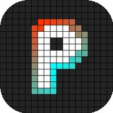
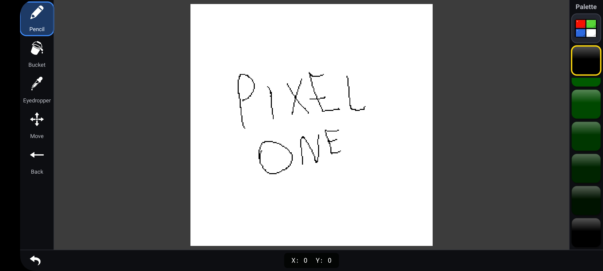
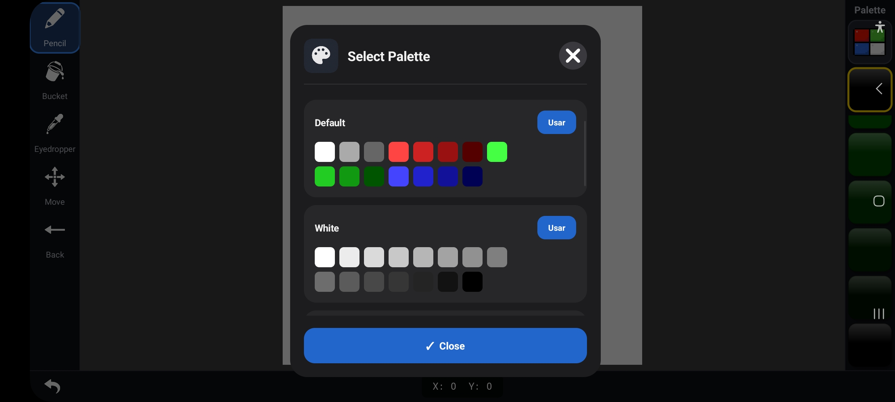
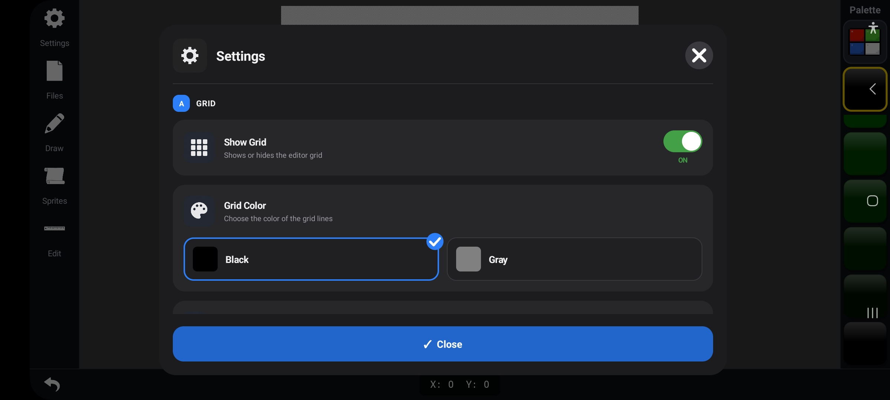

# PixelOne

**A pixel art editor for Android.**
Open it, draw, done.

[Screenshots](#-screenshots) · [Features](#-features) · [What happened](#-what-happened-to-the-release) · [Roadmap](#-roadmap) · [Contributing](#-contributing)

---

> [!WARNING]
> **There is still no APK to download.** PixelOne is being rebuilt from scratch, piece by piece.
> The core editor — canvas, tools, files — is up and working; the rest is listed in the [roadmap](#-roadmap).
> The full story of why it's a rebuild at all is [below](#-what-happened-to-the-release).

## 👋 About

PixelOne is a pixel art editor for Android, made for sprites, textures and small pixel art projects without any extra fuss.

The idea came up when I was trying to make a texture for Minecraft PE and couldn't find an editor that fit what I needed. Most of the ones I tried felt outdated or too generic, so I built my own.

It's for artists, developers, or anyone who just wants to make pixel art without fighting the app.

---

## 📸 Screenshots

> [!NOTE]
> These screenshots are from an older version. The rewrite will look a bit different, but the general idea is the same.

<table>
  <tr>
    <td align="center"> Canvas</td>
    <td align="center"> Color palette</td>
  </tr>
  <tr>
    <td align="center"> Settings</td>
  </tr>
</table>

---

## 😴 What happened to the release

Short version: I got lazy, then I made it worse.

The project already had a rough time. The Java to Kotlin migration and a big UI refactor took way longer than planned, and the release date got pushed back more than once. Somewhere along the way, laziness took over and progress crawled.

Then release day came. And I deleted the APK together with the whole project. Same day. Yes, on purpose or not, it doesn't matter, it's gone.

<strong>So what now?</strong> (click to expand)

 

I'm rebuilding PixelOne from zero, using the bits of old code I still have as reference. This time the code is cleaner, the structure is organized by topic, and the whole thing is designed to run on as many devices as possible instead of just mine.

There is **no release date** for now. I'd rather not promise another one and miss it again. What I can promise is that the new version is going to be better than the one I lost.

### 🧱 Rewrite progress

| Part | Status |
|---|:---:|
| Splash screen | ✅ Done |
| Custom pixel font | ✅ Done |
| Sidebar | ✅ Done |
| Canvas and drawing tools | ✅ Done |
| Save and open files | ✅ Done |
| Sprite sheet generator | ⏳ Planned |
| Settings and themes | 🚧 In progress |

---

## ✨ Features

What's already working in the rewrite:

| Tool | Description |
|---|---|
| ✏️ Pencil | Basic drawing tool |
| 🪣 Paint bucket | Fill areas fast |
| 🎯 Color picker | Grab any color from the canvas |
| ✋ Move | Shift the whole canvas around while you work |
| 🎨 Color palette | Manage your colors |
| 🔍 Zoom | Get in close for detail work |
| 🔳 Grid view | Toggle the pixel grid |
| 📐 Grid size | Change the pixel grid size |
| ↩️ Undo / redo | Full history support |
| 📥 Import | Open an image from storage, or straight from another app's "Open with" |
| 📤 Export | Save as PNG or JPG, from an in-app file browser |

Canvas size is fully customizable, up to `4096x4096`.

What's still on the way:

| Tool | Description |
|---|---|
| 🖼️ Sprite sheet generator | Combine multiple images into one sheet |
| 🌗 Themes | More than one color scheme for the app itself |
| 🔤 Font switcher | Pixel font, system font, or a custom one |
| ⚙️ Settings backup | Export and import your custom settings |

> [!TIP]
> Very large projects can get slow on lower-end devices. Performance work is on the roadmap.

### 🧩 Sprite sheet generator

Planned: pick multiple images and PixelOne stitches them into a single `sprite_sheet.png`, plus a JSON file describing the layout, ready to plug into a game engine.

### 🌗 Themes

The editor is dark-mode only for now (with a normal/dark checkerboard toggle for transparency). A full theme picker — Midnight Blue, Light, and whatever else comes up — is still planned.

### 🔤 Fonts

The interface uses a pixel font by default. A settings option to switch between the pixel font, the system font and a custom font is planned.

---

## ⚠️ Project status and risks

Development doesn't move at a steady pace. Sometimes there are days without commits. It doesn't mean the project is dead, it means I'm slow.

There are some real risks too:

- **Google's sideload restrictions.** Stricter rules for installing apps outside the Play Store could make distributing a standalone APK harder, or impossible, down the line.
- **No budget for the Play Store.** Publishing there needs a one-time $25 fee, which I can't afford right now.
- **Hardware.** My PC can't run Android Studio properly, so I work with a more limited setup (no Gradle, building straight from Termux). If I have to stop, picking it up again in a proper environment could take a long time.

If development pauses or ends, this README will say so honestly.

---

## 🗺️ Roadmap

- [x] Rewrite: splash, pixel font, sidebar
- [x] Canvas with pixel drawing, up to 4096x4096
- [x] Save and open files
- [ ] Sprite sheet generator
- [ ] **Layers** for outlines, base colors, shading and details
- [ ] **Mirror tool** for horizontal and vertical symmetry
- [ ] **Stamp tool** to save a piece of art and drop copies of it
- [ ] Better colors panel and custom palettes
- [ ] App themes and a font switcher
- [ ] Settings backup (export/import)
- [ ] Performance work for big canvases and sheets
- [ ] Discord server (I still haven't set it up, sorry)
- [ ] Whatever comes up from real usage and feedback

---

## 🤝 Contributing

Suggestions, bug reports and feedback are welcome. Just open a [GitHub Issue](../../issues).

## 📄 License

No license added yet. All rights reserved.

Made with too much coffee and not enough motivation.

